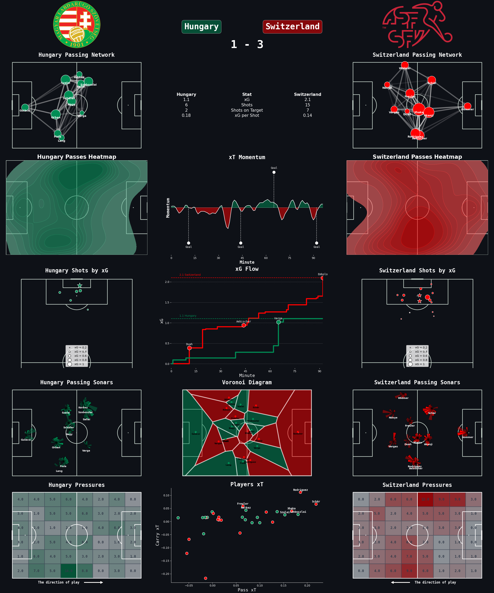

# [Dashboard Creator Website for Euro 2024](https://euro2024-dashboard-creator.onrender.com/)

This web app allows users to fully customize their match dashboards from the Euro 2024 competition.

For each match, You can choose Your desired dashboard size and configuration of plots providing better match understanding.
Later, You can easily download Your customized dashboard.

## Sample dashboards created within the app:

# Plots available
 * Tabular Overview
 * xT Match Momentum
 * xG Flow
 * Passing Networks
 * Passing Sonars
 * Shot xG Map
 * Shot Type Map
 * Pressure Heatmap
 * xT Heatmap
 * Pass heatmap
 * Action Territories
 * Voronoi Diagrams
 * Progressive Passes
 * Passes into Final 3rd
 * Passes into Penalty Area
 * xT Scatterplot by Players 

 More options to be added in the future!
 